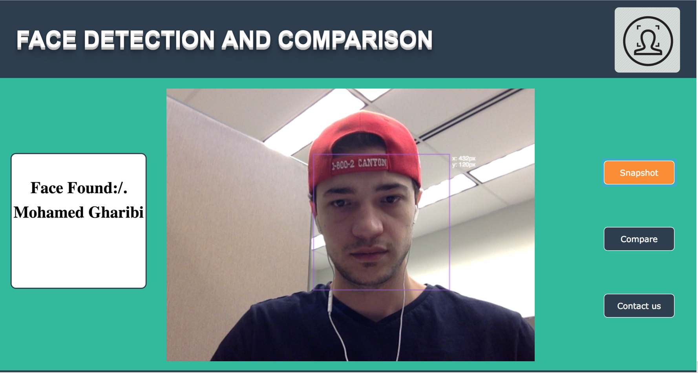
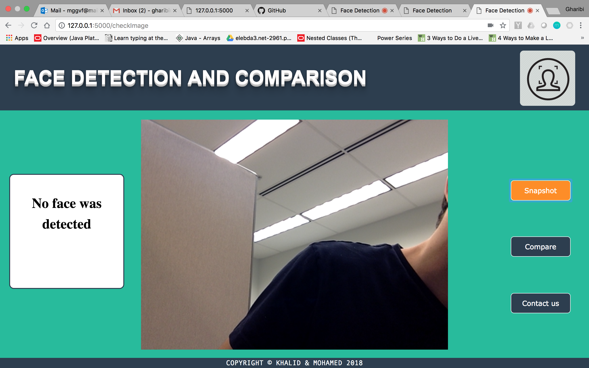

# online_face_detection_and_comparison

In this project, I am using JavaScript to start a video then detect faces and draw a square around the face.[Click here to see the same project using Opencv in Python.](https://github.com/Gharibim/StreamingVideo_Face_Detection_and_Comparission)

The only recognized face is my face is (image: me.jpg). You can simply add your image instead, then change the code print your name.

**References:**  
[tracking.js](https://github.com/eduardolundgren/tracking.js) 
[face recognition](https://pypi.org/project/face_recognition/) 
[Flask](http://flask.pocoo.org/)

